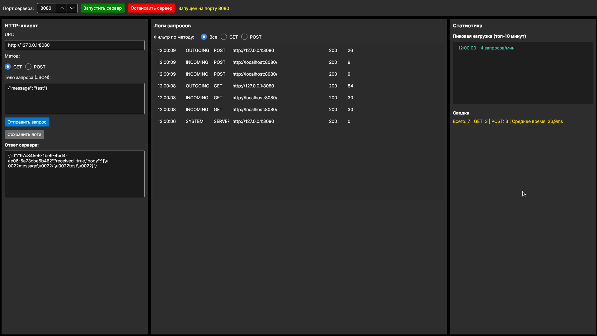

# HttpMonitorApp - Система мониторинга HTTP-запросов

## Описание проекта

Desktop-приложение для мониторинга HTTP-трафика, объединяющее в себе HTTP-сервер и HTTP-клиент. Разработано на **.NET 10** с использованием **Avalonia UI** (кроссплатформенная альтернатива WPF).

### Основные возможности

- **HTTP-сервер**: обработка GET/POST запросов, логирование, статистика
- **HTTP-клиент**: отправка запросов на внешние API
- **Мониторинг**: реальное время, статистика, пиковая нагрузка
- **Логирование**: все запросы сохраняются с возможностью фильтрации
- **Сохранение логов**: экспорт в JSON файл

## Скриншот



*Рисунок 1 - Главное окно программы*

## Технологии

| Компонент | Технология |
|-----------|------------|
| Фреймворк | .NET 10 |
| UI | Avalonia UI 11.2.5 |
| HTTP-сервер | TcpListener (ручной парсинг HTTP) |
| HTTP-клиент | HttpClient |
| Сериализация | Newtonsoft.Json |
| Архитектура | MVVM + SOLID |

## Установка и запуск

### Требования

- .NET 10 SDK
- Linux / Windows / macOS

### Клонирование репозитория

```bash
git clone https://github.com/ZenesDK/HttpMonitorApp.git
cd HttpMonitorApp
```

### Сборка и запуск

```bash
dotnet restore
dotnet build
dotnet run
```

## Использование

### 1. Запуск сервера

1. Введите порт (по умолчанию `8080`)
2. Нажмите **"Запустить сервер"**
3. Статус изменится на `"Запущен на порту 8080"`

### 2. Отправка запросов через клиент

**GET запрос:**
```
URL: http://127.0.0.1:8080
Метод: GET
Тело: (пусто)
```

**POST запрос:**
```
URL: http://127.0.0.1:8080
Метод: POST
Тело: {"message": "Hello World"}
```

**Запрос к внешнему API:**
```
URL: https://jsonplaceholder.typicode.com/posts/1
Метод: GET
```

### 3. Просмотр логов и статистики

- **Центральная панель** - все логи запросов
- **Фильтр по методу** - Все / GET / POST
- **Правая панель** - пиковая нагрузка и сводка
- **"Сохранить логи"** - экспорт в JSON файл

## Примеры работы

### GET запрос к серверу

```bash
curl http://127.0.0.1:8080
```

**Ответ:**
```json
{
  "status": "ok",
  "uptime_seconds": 3600,
  "total_requests": 5,
  "get_requests": 3,
  "post_requests": 2,
  "avg_processing_ms": 12.5
}
```

### POST запрос к серверу

```bash
curl -X POST http://127.0.0.1:8080 \
  -H "Content-Type: application/json" \
  -d '{"message": "test"}'
```

**Ответ:**
```json
{
  "id": "550e8400-e29b-41d4-a716-446655440000",
  "received": true,
  "body": "{\"message\": \"test\"}"
}
```

## Структура проекта

```
HttpMonitorApp/
├── Models/
│   ├── RequestInfo.cs      # Модель запроса
│   ├── LogEntry.cs          # Модель лога
│   └── Statistics.cs        # Модель статистики
├── Services/
│   ├── IHttpServer.cs       # Интерфейс сервера
│   ├── HttpServerService.cs # Реализация сервера (TcpListener)
│   ├── IHttpClient.cs       # Интерфейс клиента
│   ├── HttpClientService.cs # Реализация клиента (HttpClient)
│   ├── ILoggingService.cs   # Интерфейс логирования
│   └── LoggingService.cs    # Реализация логирования
├── ViewModels/
│   ├── ViewModelBase.cs     # Базовый класс
│   ├── RelayCommand.cs      # Реализация команд
│   └── MainWindowViewModel.cs # Основная ViewModel
├── Views/
│   └── MainWindow.axaml     # XAML разметка
└── Program.cs               # Точка входа
```

## Возможные проблемы и решения

### Порт уже используется

```bash
# Найти процесс, использующий порт
sudo lsof -i :8080

# Убить процесс
kill -9 <PID>

# Или сменить порт в приложении
```

### Сервер не запускается на Linux

Используйте `127.0.0.1` вместо `localhost`:
```
URL: http://127.0.0.1:8080
```

### Таймаут запроса

Проверьте, что сервер запущен, и URL правильный.